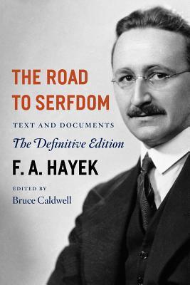
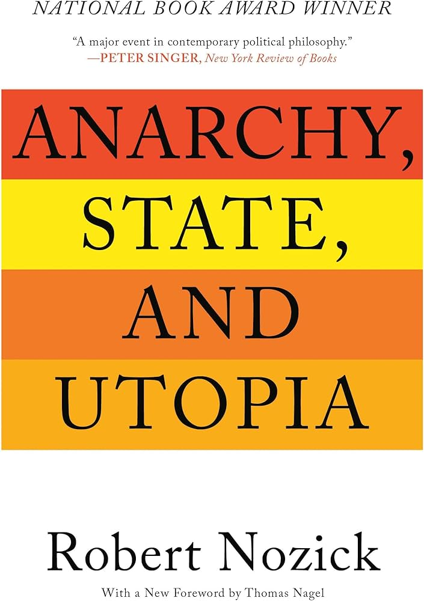

### Philosophy 

#### LIBERATARIANISM 

##### Friedrich Hayek 

- Hayek's main thesis is that complex societies cannot be effectively planned because knowledge is **dispersed, local and tacit**. This means that Central Planners do not have the capacity to know all the details required to make decisions. He also emphasized that prices would act as information signals and that markets and law could emerge without central design. Expansive State planning erodes individual freedom. He argued for **classical liberalism** which was grounded in *rule of law*, *limited government*, *private property* and *open competition*. 

  
--- 

#####  Robert Nozick

- Nozick's case is that individuals have an inviolable self and property rights and the state is only justified in protecting those property rights. Any paternal or redistributive action violates those rights. 

